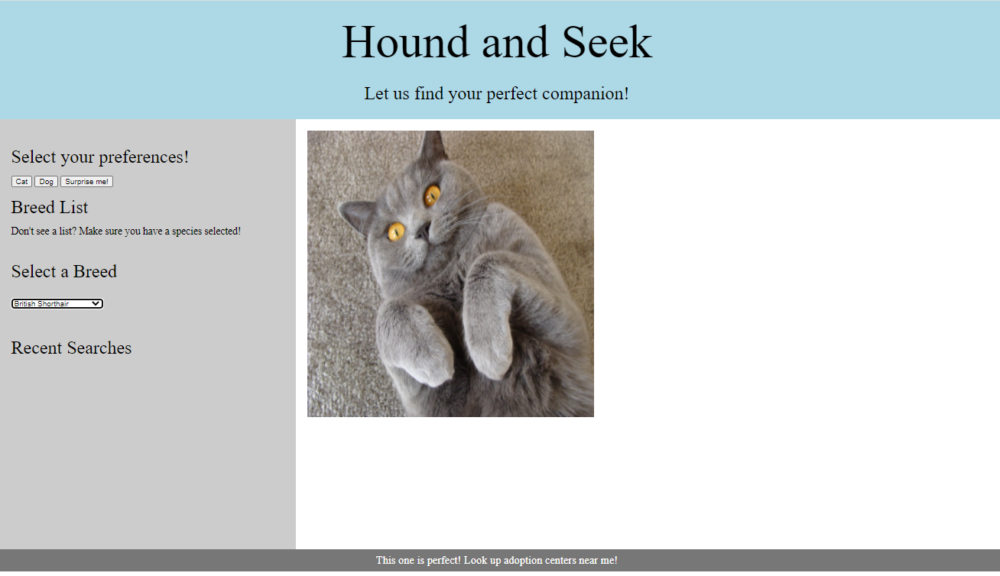

# Hound and Seek
Together we built a web page where a user can go in, select a species (dog or cat), select a breed, and view images about the breed. If the user likes the appearance of that animal, they can select the button at the bottom to go to a page where we will return shelters that are local to them so they can go and adopt. 

## Contact information and Deployment
Created by: Greyson Mainor, Heather Smith, Obedia Lawerence, and Tori Sanford
Date: 01/28/2021
Contact: 
Greyson- gbmainor98@outlook.com
Obedia- omlawrence24@gmail.com
Heather- halexsmith86@gmail.com
Tori- Tori.danielle.clark91@gmail.com

Link to deployed project:  https://tsanfordgatech.github.io/HoundandSeek/
Screen shot of completed assignment: 

## About this Project: 
One stop shop for users to find their future pet. We utalized three API's, built out our own HTML, CSS, and containers, tokens, and jqeury. 

## What we learned from this project: 
- Greyson- Utalization of click event handlers with function, dynamics, and furthering my understanding of if/and/then statements. 
- Heather - Learned a lot about user secrets, tokens, and API's key + their security. 
- Obedia - How to traverse the APIs objects and learned more about GITHUB.
- Tori - Deepended my understanding on How to build containers to respond to the objects. 

## User Story
As a user, I want to enter a breed of cat or dog 
Then a image of the breed is returned to me 
I can then use the rescue portion to identify locations near me where that mix or breed is avb

## Acceptance Criteria
- If I select a button the breed list generates with that species list 
- when I select a breed an image will appear
- when I select to go to the rescue pages it will take me to the form to put in my zip
- when my zip is enetered it will return to me local shelters
- when I hit return at the bottom of the page I go back to square one
